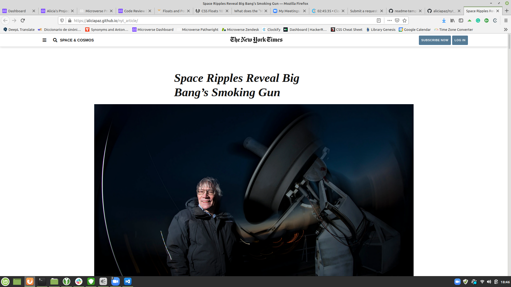

# New York Times article page

The main purpose of this project is to develop basic understanding of HTML and CSS languages for web development. In order to achieve this, a copy of a New York Time's article page was made, using HTML and CSS.
The original webpage can be seen at [New York Times Article](https://www.nytimes.com/2014/03/18/science/space/detection-of-waves-in-space-buttresses-landmark-theory-of-big-bang.html?_r=0#)



The website has the main article, a top navigation bar, a bottom section with links to other articles and a bottom navigation bar with links to other pages of the site.

## Built With

- HTML5
- CSS

## Live Demo

[Live Demo Link](https://livedemo.com)

## Getting Started

Use your main live server to start live viewing the index.html file on your web browser.

## Prerequisites

Install git from [git](https://git-scm.com/)

## Setup

Fork or git pull the proyect from [proyect](https://github.com/aliciapaz/nyork-article.git)

## Install

If you want to check linters you can

```
npm install
```

## Usage

You can check the page from your browser with a live server extension for your text editor or going to the github page [github page](https://aliciapaz.github.io/nyork-article/)

## Run tests

### Webhint:

Run
```
npx hint .
```

### Stylint:

Run
```
npx stylelint "\*_/_.{css,scss}"
```

## Deployment

Deployment in this [github page](https://aliciapaz.github.io/nyork-article/)
## Authors

👤 **Alicia Rojas**

- Twitter [@aliciap38180090](https://twitter.com/@aliciap38180090)
- GitHub: [@aliciapaz](https://github.com/aliciapaz)

👤 **Jaim Delmar**

- Twitter: [@Usernamejaim](https://twitter.com/Usernamejaim)
- GitHub: [@jaimdedan](https://github.com/jaimdedan)

## 🤝 Contributing

Contributions, issues, and feature requests are welcome!

Feel free to check the [issues page](issues/).

## Show your support

Give a ⭐️ if you like this project!

## Acknowledgments

- To each of the Authors for the hardwork.

## 📝 License

This project is [MIT](lic.url) licensed.
